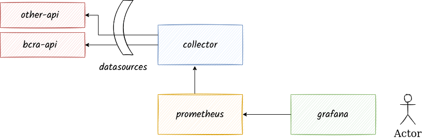

# bcra-api
Project that gathers information from BCRA API
Stack:
 - Python
 - Prometheus
 - Grafana




### query BCRA API

```bash
curl https://api.estadisticasbcra.com/usd -H "Accept: application/json" -H "Authorization: Bearer {token}"
```

## References 
- https://estadisticasbcra.com/api/documentacion
